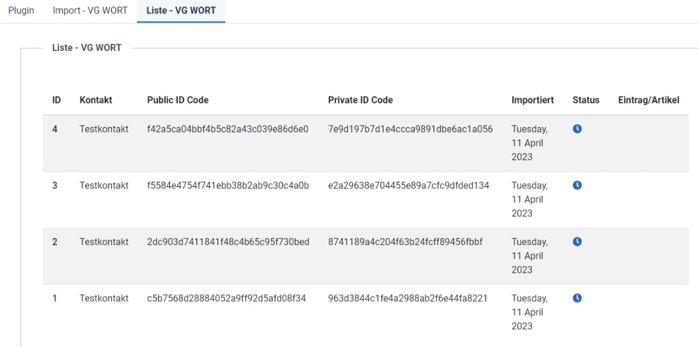

 
  <!--  -->

  &#xa0;

  <!-- <a href="#">Demo</a> -->

<h1 align="center">Zählerpixel VGW Plugin für Joomla</h1><h2 align="center">SimplySmart Open Source</h2>

  

  

  

  

  <!--  -->

  <!--  -->

  <!--  -->

<!-- Status -->

<h4 align="center"> 
	🚧  Zählerpixel VGW Plugin für Joomla 🚀 Under construction...  🚧
</h4> 

  <a href="#dart-about">About</a> &#xa0; | &#xa0; 
  <a href="#sparkles-features">Features</a> &#xa0; | &#xa0;
  <a href="#rocket-features-roadmap">Roadmap</a> &#xa0; | &#xa0;
  <a href="#mag_right-technologies">Technologies</a> &#xa0; | &#xa0;
  <a href="#white_check_mark-requirements">Requirements</a> &#xa0; | &#xa0;
  <a href="#checkered_flag-starting">Let's start</a> &#xa0; | &#xa0;
  <a href="#memo-license">License</a> &#xa0; | &#xa0;
  <a href="https://github.com/SimplySmart-IT" target="_blank">Author</a>

 

## :dart: About ##

**Dieses Plugin unterstützt bei der automatischen Zuordnung der VG Wort Zählermarke für das CMS Joomla.**

*Die Test-Datei im Ordner TestData dient nur zu **Testzwecken**.*\
*Quelle der Daten ist die PDF-Datei [Integration Manual for Publishers - REST (Stand: 21.02.2023)](https://tom.vgwort.de/Documents/pdfs/dokumentation/metis/DOC_Verlagsmeldung_REST_EN.pdf) direkt aus dem Hilfeportal des VG Wort T.O.M Systems. - Stand: 07.04.2023*\

***Bitte den Ordner TestData nicht in ein Produktivsystem übernehmen!***

## :sparkles: Features ##

:heavy_check_mark: CSV-Import Zählermarken\
:heavy_check_mark: Zuordnung der Zählermarken zu verschiedenen Kontakten\
:heavy_check_mark: Überprüfung der Referrer Policy - nur Joomla System Plugin\
:heavy_check_mark: Zuordnung der Marken zu Beiträgen in Abhängikeit zur Mindest-Textlänge\
:heavy_check_mark: automatische Einbinden in Beiträge entsprechend der Vorgaben der VG Wort\

## :rocket: Features Roadmap ##
 - [ ] bereits zugeordneter Zählermarken aus Texten übernehmen\
 - [ ] Kopieren von Text, Headline und Url aus der Zählermarken-Liste (Jahres-Meldung)\
 - [ ] Filtern und Sortieren der Zählermarken-Liste\
 - [ ] Zählermarken-Listen-Feld automatisch neu laden nach Ajax-Import\
 - [ ] ACL - Benutzerrechte\
 - [ ] Info-Nachricht zur Anzahl der noch freien Marken - nach Speichern und Neuzordnung im Beitrag\
 - [ ] Info-Nachricht wenn keine Marken zugeordnet wurde obwohl die Textlänge erreicht wurde\
 - [ ] Einstellungen: Filter - unterstützte Beitrags-Kategorien\
 - [ ] Einstellungen: Filter - Kontakt-Kategorien\

## :mag_right: Technologies ##

The following tools were used to create this this project:

- [Joomla](https://www.joomla.org/)[^1]
- [Digital-Peak/DPDocker](https://github.com/Digital-Peak/DPDocker)

## :white_check_mark: Requirements ##

Um dieses Plugin nutzen zu können, wird eine Joomla Installation in der Version 4 oder höher benötigt ([Joomla](https://www.joomla.org/) - [Joomla auf Deutsch](https://www.joomla.de/)) [^1], sowie die Registrierung als Urheber bei der [VG WORT - T.exte O.nline M.elden](https://tom.vgwort.de/portal/index) [^2].

## :checkered_flag: Let's start ##

Das Plugin kann als Beta-Version zum testen bereits heruntergeladen werden. 
Diese Erweiterung befindet sich noch in einer frühen Beta-Phase. Ich empfehle nicht sie bereits auf einer Live-Website einzusetzen.

### Schritt 1 - Installation und Grundeinstellungen

Installation des Plugin wie gewohnt im Installationsmanager von Joomla.
Suchen Sie das Plugin in der Plugin-Liste und aktivieren Sie es gegebenfalls.

Die vordefinierten Standardwerte kommen aus der derzeit gültigen Systembeschreibung für Urheber der VG-WORT (Stand: 06.02.2023). Die Angaben können nach Bedarf jederzeit geändert werden. Bitte informieren Sie sich über die passenden Werte direkt bei der VG WORT [VG WORT - Hilfe](https://tom.vgwort.de/portal/showHelp)

### Schritt 2 - Zählmarken import

Bestellen Sie Ihre Zählmarken im Online-System der VG WORT und laden Sie sich die Zählmarken als CSV Datei herunter.
Bitte achten Sie darauf, dass Sie die Zählmarken-Liste mit den reinen Identifikations-Keys herunterladen.

 *- Quelle VW WORT [Quelle]https://tom.vgwort.de/Documents/pdfs/dokumentation/metis/DOC_Verlagsmeldung_REST.pdf] - Seite 10*

Eine Testdatei finden Sie in diesem Repository im Ordner TestData.

Wählen Sie nun den Tab **Import VG WORT** in den Plugin-Einstellungen.
Erstellen oder wählen Sie einen vorhanden Kontakt aus, dem die Liste zugeordnet werden soll und importieren Sie die Datei. So können Sie auch die Zählmarken mehrerer Autoren für Ihre Joomla Seite verwalten.

Im Reiter **Liste VG WORT** finden Sie nach dem erneuten laden der Seite alle importierten Zählmarken.

### Schritt 3 - Zuordnung zu Beiträgen / Artikeln

In der Bearbeitungs-Ansicht für einen Beitrag finden Sie im Reiter **Optionen** die Autoren-Einstellungen.
Hier wählen Sie im Feld **Kontakt VGWORT Pixel** den passenden Kontakt aus, von dessen Zählermarken-Liste eine ID zugeordnet werden soll.

Sobald Ihr Beitrag mindestens die in den Plugin-Einstellungen ausgewählte Text-Länge erreicht und ein Kontakt zugeordnet ist, wird beim Speichern automatisch eine Zählmarke zugeordnet.

Es wird dabei der reine Text berücksichtig und vorab Bilder und Tabellen entsprechend der Dokumentation der VG WORT herausgefiltert.

### Schritt 4
Verknüpfungen von Zählmarken zu Inhalten können nach Veröffentlichung nicht mehr entfernt werden. Wenn Sie den Kontakt aus dem Feld im Beitrag entfernen wird die Marke in der Frontend-Ansicht aber nicht mehr berücksichtigt / angezeigt.

Sie können in der Listen-Ansicht im Plugin sehen, welche Marken bereits eine Zuordnung haben.

### Ausspielen im Frontend

Entsprechend der Dokumentation der VG WORT werden die Marken in Ihren Beiträgen unterschiedlich eingefügt.
In der einfachen Beitragsansicht werden die Zählmarken ohne Lazy-Loading am Anfang des Textes eingefügt. Hier kann davon ausgegangen werden, dass der Leser den Beitrag bewusst angewählt hat.
In der Ansicht der Haupteinträge und im Kategorie-Blog werden die Zählmarken mit Lazy-Loading geladen und bei voller Beitragsansicht etwa in der Hälfte des Beitrags eingefügt.
Sollte es sich um einen Introtext handeln entscheidet die Länge des Introtextes. Liegt die berechnete Text-Länge unter der Mindeszeichenanzahl in den Einstellungen des Plugins wird gar kein Pixel geladen. Ist die Länge gleich oder liegt darüber wird die Zählmarke direkt nach der Mindestzeichanzahl entsprechend den Plugin-Einstellungen gerendert.

### Mehrseitige Beiträge

Sollten Sie Ihre Artikel als mehrseitige Beiträge über das Joomla Plugin (pagebreak / Seitenumbruch) ausspielen, achten Sie bitte auf die Reihenfolge der Plugins. Das Zählerpixel VGW Plugin darf erst nach dem System Plugin **Seitenumbruch** geladen werden.

## Unterstützung
Du möchtest mich und meine zukünftigen Entwicklungen unterstützen?!? :tada::rocket: Vielen Dank !!! :heart:

&#xa0;

## :memo: License ##

This project is under GNU General Public License version 2 or later;. For more details, see the [LICENSE](LICENSE.md) file.

Made with :heart: by <a href="https://github.com/SimplySmart-IT" target="_blank">Martina Scholz</a>

&#xa0;

[^1]: This plugin - Zählerpixel VGW Plugin für Joomla - is not affiliated with or endorsed by The Joomla! Project™. Any products and services provided through this site are not supported or warrantied by The Joomla! Project or Open Source Matters, Inc. Use of the Joomla!® name, symbol, logo and related trademarks is permitted under a limited license granted by Open Source Matters, Inc.

[^2]: Diese Erweiterung - Zählerpixel VGW Plugin für Joomla - wird von der VG WORT weder unterstützt noch von ihr vertrieben.

<a href="#top">Back to top</a>
